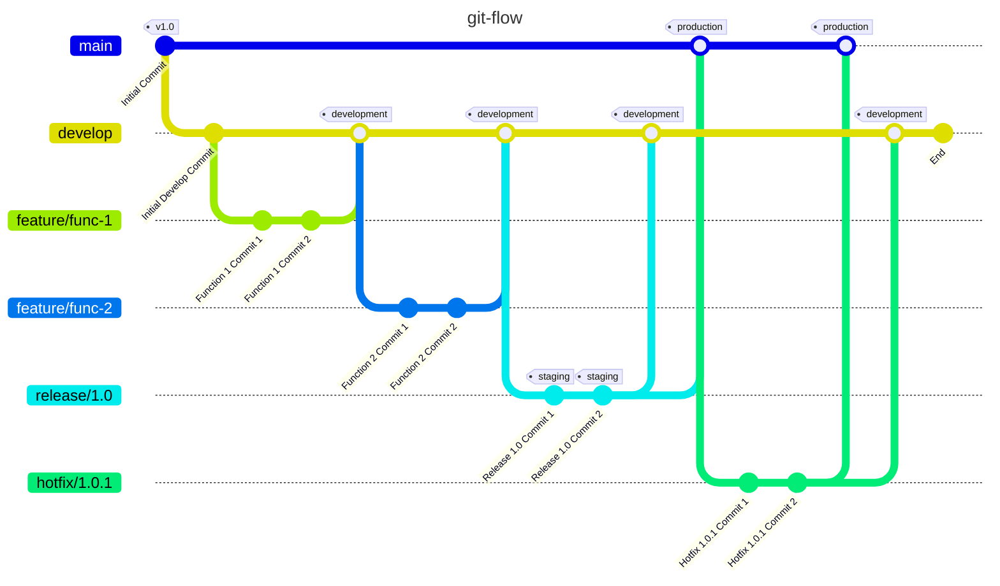

# GitHub environments sample

## git-flow

```mermaid
---
title: git-flow
---
gitGraph
  commit id: "Initial Commit" tag: "v1.0"

  branch develop
  commit id: "Initial Develop Commit"

  branch feature/func-1
  commit id: "Function 1 Commit 1"
  commit id: "Function 1 Commit 2"
  checkout develop
  merge feature/func-1 tag: "development"

  branch feature/func-2
  commit id: "Function 2 Commit 1"
  commit id: "Function 2 Commit 2"
  checkout develop
  merge feature/func-2 tag: "development"

  branch release/1.0
  commit id: "Release 1.0 Commit 1" tag: "staging"
  commit id: "Release 1.0 Commit 2" tag: "staging"
  checkout develop
  merge release/1.0 tag: "development"
  checkout main
  merge release/1.0 tag: "production"

  branch hotfix/1.0.1
  commit id: "Hotfix 1.0.1 Commit 1"
  commit id: "Hotfix 1.0.1 Commit 2"
  checkout main
  merge hotfix/1.0.1 tag: "production"
  checkout develop
  merge hotfix/1.0.1 tag: "development"
  commit id: "End"
```
